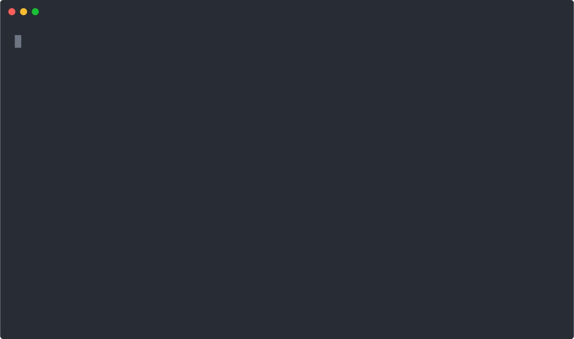

# dAppBooster installer

Agent-friendly installer for [dAppBooster](https://dappbooster.dev/) that scaffolds Web3 dApps via TUI or non-interactive CLI/CI with JSON output.

## Requirements

- Node >= 20
- pnpm

## Usage



```shell
pnpm dlx dappbooster
```

dAppBooster documentation: https://docs.dappbooster.dev/

## Agent / CI quickstart

Use `--info` to discover features, then run a non-interactive install that returns JSON.

```shell
pnpm dlx dappbooster --info
pnpm dlx dappbooster --ni --name my_dapp --mode full
```

## Agent / non-interactive / CI mode

The installer supports a non-interactive mode for CI pipelines and AI agents. It activates automatically when stdout is not a TTY, or explicitly with the `--ni` flag.

### Discover available features

```shell
pnpm dlx dappbooster --info
```

```json
{
  "features": {
    "demo": {
      "description": "Component demos and example pages",
      "default": true
    },
    "subgraph": {
      "description": "TheGraph subgraph integration",
      "default": true,
      "postInstall": [
        "Provide your own API key for PUBLIC_SUBGRAPHS_API_KEY in .env.local",
        "Run pnpm subgraph-codegen from the project folder"
      ]
    },
    "typedoc": {
      "description": "TypeDoc API documentation generation",
      "default": true
    },
    "vocs": {
      "description": "Vocs documentation site",
      "default": true
    },
    "husky": {
      "description": "Git hooks with Husky, lint-staged, and commitlint",
      "default": true
    }
  },
  "modes": {
    "full": "Install all features",
    "custom": "Choose features individually"
  }
}
```

### Full install

```shell
pnpm dlx dappbooster --ni --name my_dapp --mode full
```

```json
{
  "success": true,
  "projectName": "my_dapp",
  "mode": "full",
  "features": ["demo", "subgraph", "typedoc", "vocs", "husky"],
  "path": "/absolute/path/to/my_dapp",
  "postInstall": [
    "Provide your own API key for PUBLIC_SUBGRAPHS_API_KEY in .env.local",
    "Run pnpm subgraph-codegen from the project folder"
  ]
}
```

### Custom install with selected features

```shell
pnpm dlx dappbooster --ni --name my_dapp --mode custom --features demo,subgraph
```

```json
{
  "success": true,
  "projectName": "my_dapp",
  "mode": "custom",
  "features": ["demo", "subgraph"],
  "path": "/absolute/path/to/my_dapp",
  "postInstall": [
    "Provide your own API key for PUBLIC_SUBGRAPHS_API_KEY in .env.local",
    "Run pnpm subgraph-codegen from the project folder"
  ]
}
```

### Error handling

Errors return structured JSON with a non-zero exit code:

```shell
pnpm dlx dappbooster --ni --mode full
```

```json
{
  "success": false,
  "error": "Missing required flag: --name"
}
```

## Development

Clone the repo

```shell
git clone git@github.com:BootNodeDev/dAppBoosterInstallScript.git
```

Move into the folder you just created and install the dependencies

```shell
cd dAppBoosterInstallScript

pnpm i
```

You can run the script by doing

```shell
node cli.js
```

## Releasing new versions to NPM

New releases are automatically uploaded to NPM using GitHub actions.
